# scp2pdf

A Python tool to generate clean, beautifully formatted PDFs from SCP Foundation Wiki entries and tales. It strips away UI elements, extracts relevant metadata, and supports custom themes and images.

<p align="center">
  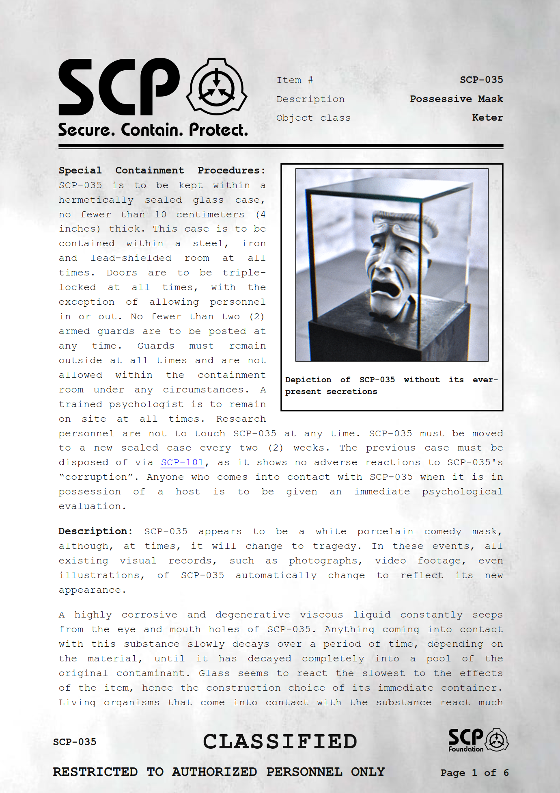
  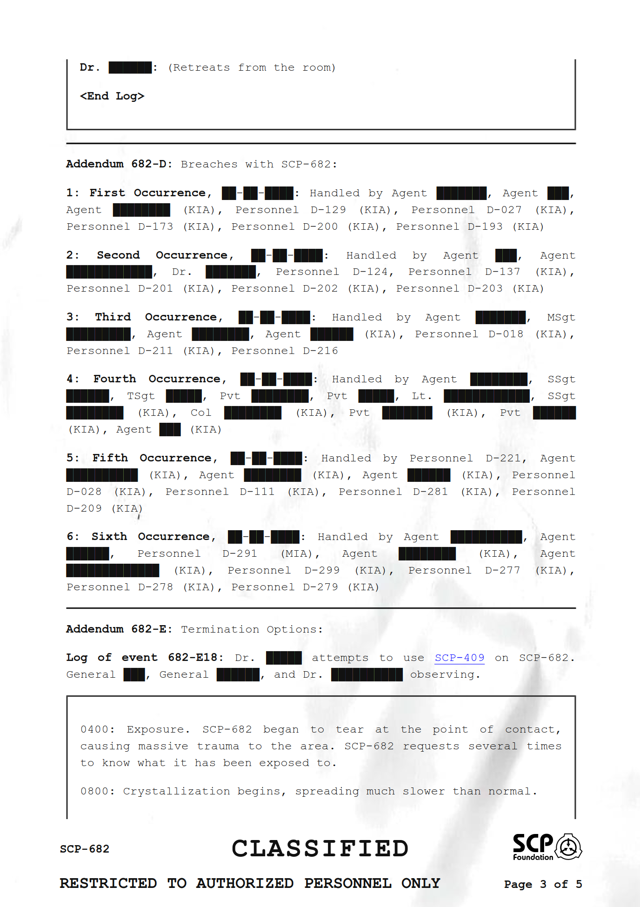
  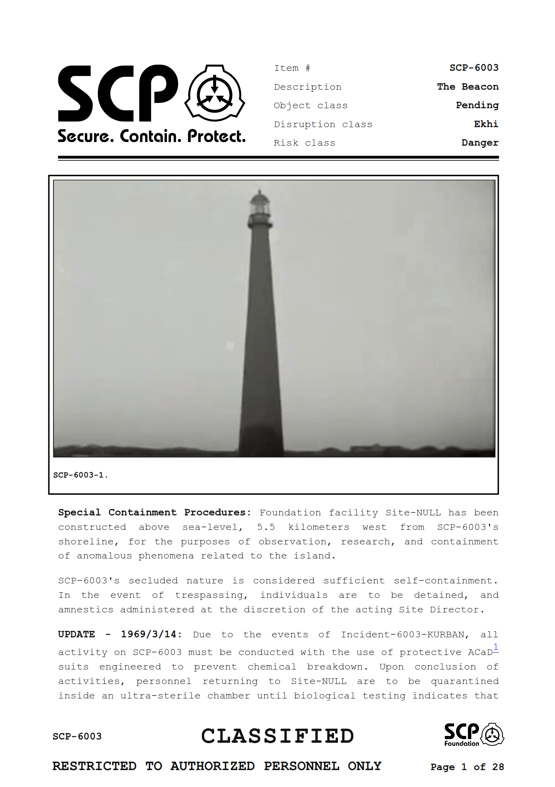
</p>


## Installation

Download the repository as a ZIP, or clone it with git:
```bash
git clone https://github.com/pablogila/scp2pdf.git
cd scp2pdf
```

then create a Python virtual environment,
```bash
python -m venv .venv
```

and activate it,
```bash
source .venv/bin/activate  # Or on Windows: .venv\Scripts\activate
```

and finally install the required dependencies:
```bash
pip install -r requirements.txt
```


## Usage


### Command Line Interface

You can generate a PDF by passing either an SCP number or a full Wikidot URL. For example:

```bash
python scp2pdf.py 035
```

You could also specify custom options with flags like `--theme`, `--image`, `--caption`, and `--outdir`:

```bash
python scp2pdf.py 173 \
  --theme default \
  --image https://upload.wikimedia.org/wikipedia/commons/c/c7/MatthewF1.png \
  --caption "Artistic depiction of SCP-173 by ThyCheshireCat" \
  --outdir "./examples"
```


### Python API

The same custom arguments can be used with the Python API:

```python
import scp2pdf
scp2pdf.generate(
    target="173",
    theme="report",
    image="https://upload.wikimedia.org/wikipedia/commons/c/c7/MatthewF1.png",
    caption="Artistic depiction of SCP-173 by ThyCheshireCat",
    outdir="./examples"
)
```

The `examples.py` script contains more usage examples,
and it is used to generate the sample PDF files in the `examples/` directory.


## Themes

If no theme is specified, the `report` theme will be used.
Themes with backgrounds have them randomized by default.

### report

<p align="center">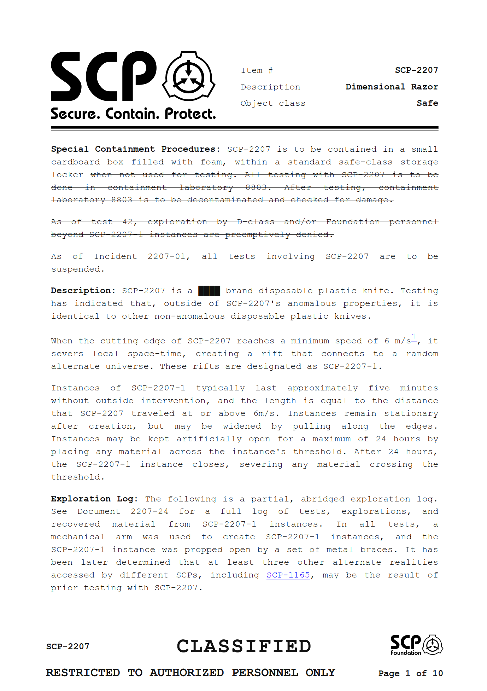</p>

### book

<p align="center">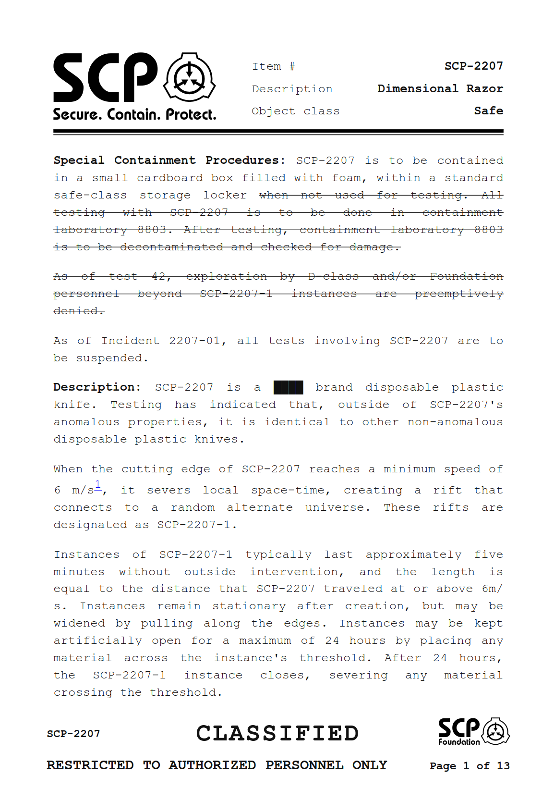</p>

### scan

<p align="center">
  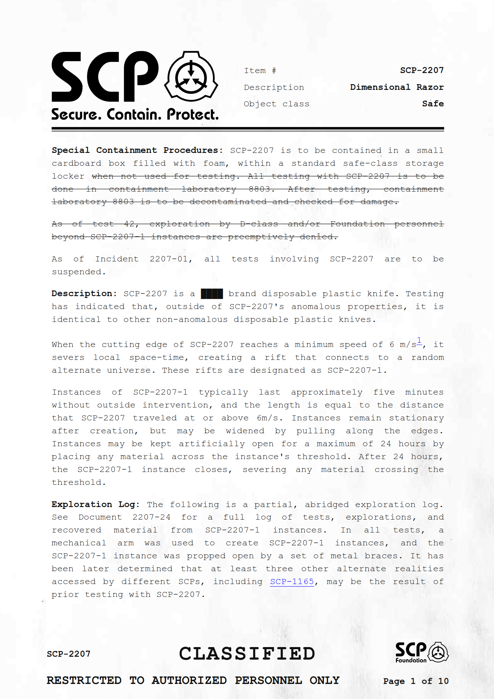
  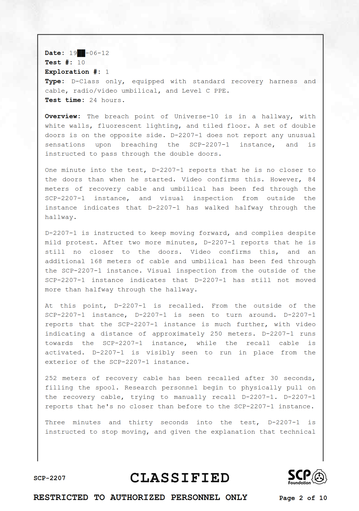
</p>

### badscan

<p align="center">
  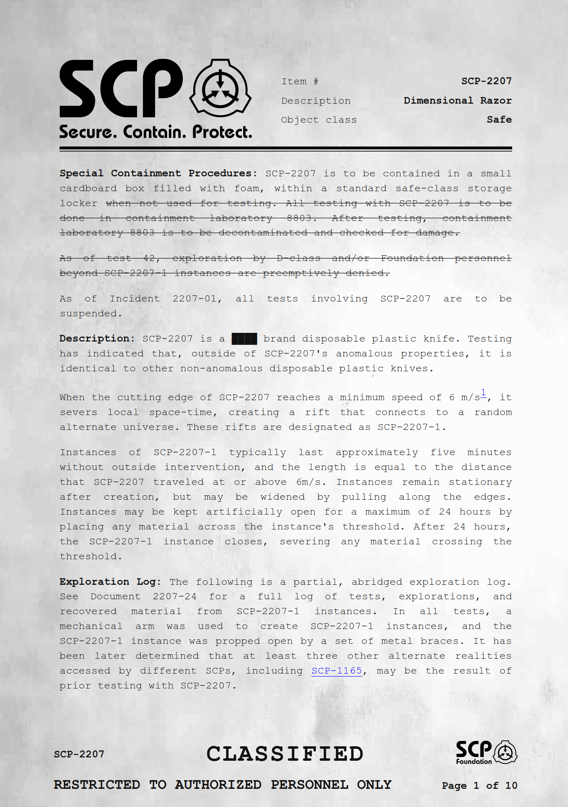
  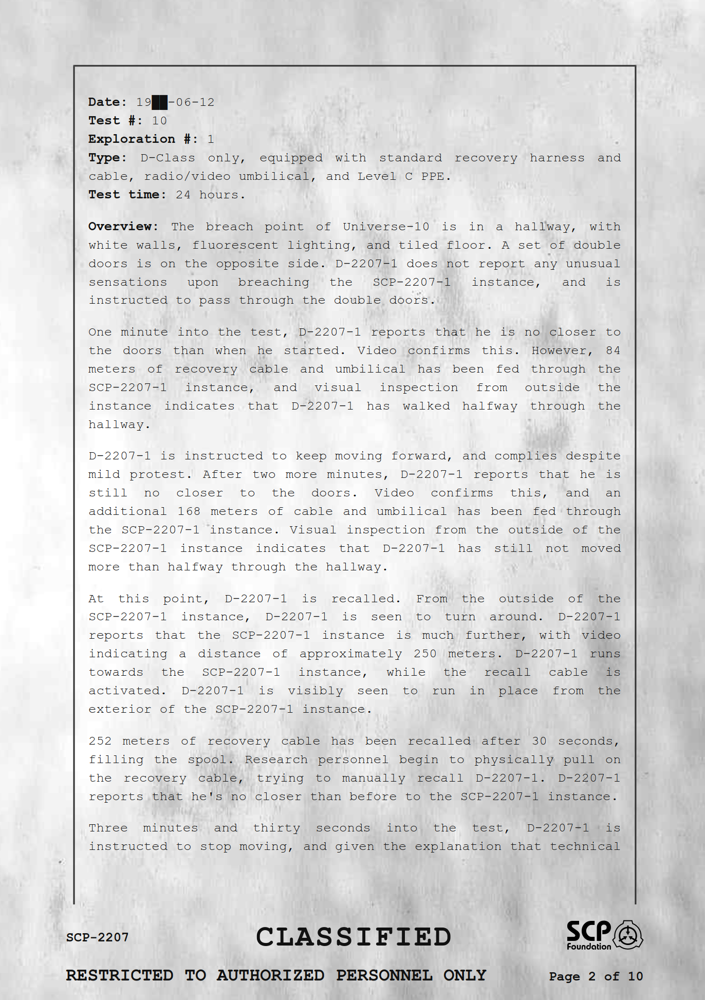
</p>

### wrinkled

<p align="center">
  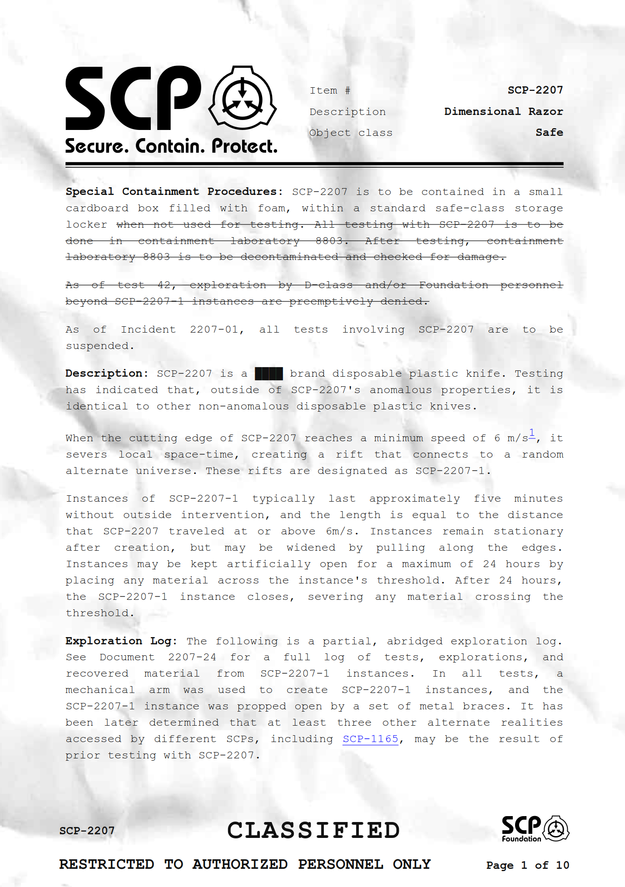
  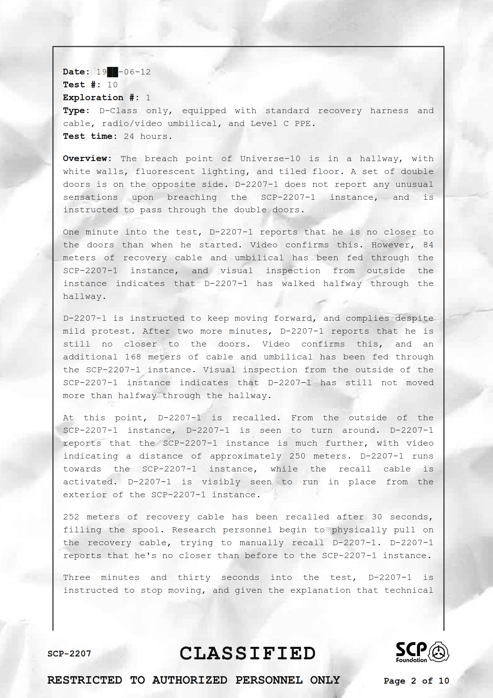
</p>

### shredded

<p align="center">
  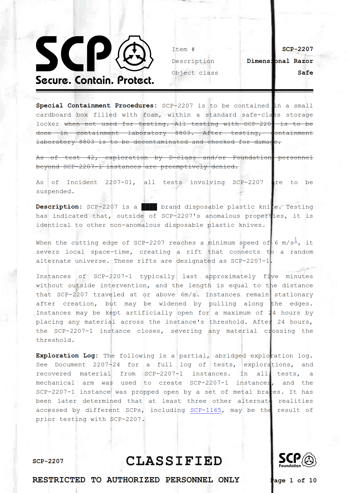
  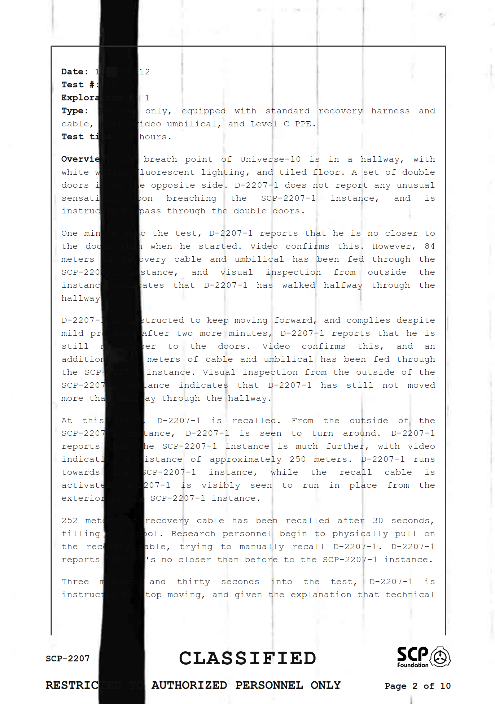
</p>


## Custom themes

Themes are controlled by matching HTML and CSS templates stored in the `themes/` directory. Fonts, logos, item placement and everything else can be customized from those files.
Custom backgrounds can also be included inside a folder with the same name as the HTML and CSS files.
The background images can be randomly rotated and flipped with the
`theme-randomize` meta tag in the HTML template, see the `scan` theme as reference.


## Contributing

Do you want to share your own themes or improvements? Feel free to submit a pull request with your contributions! :D


## License

The original [SCP logo](https://commons.wikimedia.org/wiki/File:SCP_Foundation_(emblem).svg)
is licensed under CC BY-SA 3.0.
Derivative logos under the `logos/` directory also follow the same license.

The scp2pdf software itself is licensed under GNU AGPL v3.0 or later:

    scp2pdf - Compile SCP entries into stylish PDF reports.
    Copyright (C) 2026 Pablo Gila-Herranz.

    This program is free software: you can redistribute it and/or modify
    it under the terms of the GNU Affero General Public License as published
    by the Free Software Foundation, either version 3 of the License, or
    (at your option) any later version.

    This program is distributed in the hope that it will be useful,
    but WITHOUT ANY WARRANTY; without even the implied warranty of
    MERCHANTABILITY or FITNESS FOR A PARTICULAR PURPOSE.  See the
    GNU Affero General Public License for more details.

